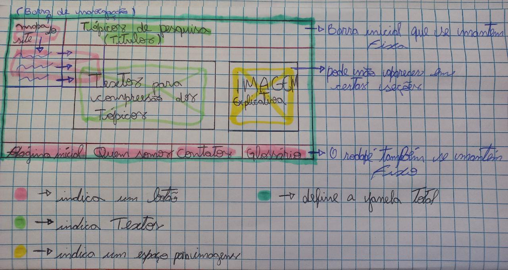

# Sprint 1 - Layout do projeto
 

  <a href ="#backlog"> Backlog da Sprint </a>  •
  <a href ="historias"> Histórias de Usuário •
  <a href ="#roadmap"> Roadmap </a> •
  <a href ="#tarefas"> Tarefas </a>

 
> Status da Sprint: Concluída

 
 

As tarefas dessa primeira Sprint foram escolhidas e criadas de maneira que pudessemos criar uma estrutura inicial do site e a mesma fosse validada, então foi desenvolvido um layout para o site de treinamento, para que se possa ver de forma inicial a distribuição das informações do site.
 
 

## Backlog da Sprint 

|                            Tarefa                            |                          Descrição                           |               Histórias de Usuários                | Prioridade | Sprint | Estimativa de Esforço |       Status       |
| :----------------------------------------------------------: | :----------------------------------------------------------: | :------------------------------------------------: | :--------: | :----: | :-------------------: | :----------------: |
| Wireframe do projeto | Visualizar de forma macro como será o esqueleto do site para criação do protótipo | <a href='#us01'>US01</a> | Média | 1 | 4h | :white_check_mark: |
| Criação de protótipo para o projeto |  Criar um protótipo simples e objetivo para que o cliente visualize o layout do site e a forma como as informações estão distribuidas, para então iniciar o processo de forma mais detalhada | <a href='#us02'>US02</a> | Alta | 1 | 8h | :white_check_mark: |
| Criação e organização do projeto no Github |  Criação de diretorios específicos para certos arquivos e organização dos mesmos  | <a href='#us03'>US03</a> | Alta | 1 | 4h | :white_check_mark: |

 

## 📖 Histórias de Usuário

|          ID           |                     História de Usuário                      |
| :-------------------: | :----------------------------------------------------------: |
| US01 | Eu como desenvolvedor, quero criar o esqueleto do site para começar a criação do protótipo |
| US02 | Eu como "cliente", quero visualizar a estrutura do projeto para validar o mesmo |
| US03 | Eu como Time de Desenvolvimento, quero ter acesso aos arquivos do projeto e a versões do projeto para efetuar futuras alterações | 

 

## Tarefas 
 

1. Criação do wireframe 

A montagem do wireframe inicial foi construida no papel para que pudessemos visualizar de forma macro o esqueleto do site, e imaginar a distribuição de seu conteúdo, levando em consideração as expectavivas e necessidades do usuário final.

<h1 align="center"></h1> 

2. Criação do protótipo do projeto

Após o wireframe inicial ser feito, foi iniciado o processo de criação do protótipo com a ferramenta figma, para que pudessemos visualizar a interface gráfica do projeto e a mesma fosse validada.
 

<a href ="https://www.figma.com/proto/yqF7J7uYamFOZbklzddYj5/Untitled?page-id=0%3A1&node-id=1-2&viewport=861%2C504%2C0.32&scaling=scale-down&starting-point-node-id=26%3A42">Link para acessar o Protótipo (Figma)</a>
 

3. Criação e Organição do projeto no Github

Para que pudessemos documentar as diversas etapas e versior o projeto foi criado um repositório e organizado de forma lógica e clara para agrupar os diversos tipos de arquivos referentes ao projeto.