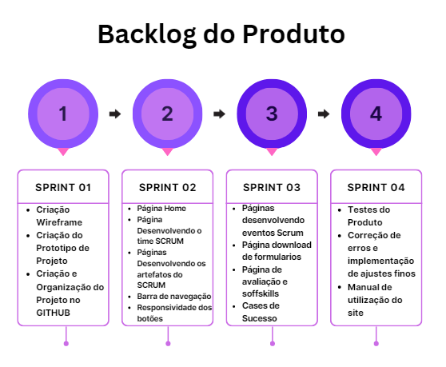

# Sprint 3 - Desenvolvimento do site
 

  <a href ="#backlog"> Backlog da Sprint </a>  •
  <a href ="historias"> Histórias de Usuário •
  <a href ="#roadmap"> Roadmap </a> •
  <a href ="#tarefas"> Tarefas </a>

 
> Status da Sprint: Em andamento

 
 

As tarefas para a terceira Sprint foram elaboradas de maneira que se pudesse finalizar a implementação do conteúdo imprescindível do site, trabalhar os formulários para avaliação, disponibilizar exemplos de modelos dos artefatos da metologia e elaborar as páginas sobre Soft skills e cases de sucesso.

## 🔮 Backlog da Sprint 

|                            Tarefa                            |                          Descrição                           |               Histórias de Usuários                | Prioridade | Sprint | Estimativa de Esforço |       Status       |
| :----------------------------------------------------------: | :----------------------------------------------------------: | :------------------------------------------------: | :--------: | :----: | :-------------------: | :----------------: |
| Páginas Desenvolvendo os eventos do SCRUM |  Criação das páginas de conteúdo do site referente aos eventos do SCRUM | <a href='#us013'>US13</a> | Alta | 3 | 16h | 🚧 |
| Formulários com exemplos dos artefatos do SCRUM | Criação de 2 formulários de exemplo para cada artefato da metodologia para o usuário poder baixar | <a href='#us18'>US18</a> | Média | 3 | 8h | 🚧 |
| Páginas de avaliação do conteúdo | Criação de formulário de avaliação para avaliar o colaborador sobre o conteúdo do site | <a href='#us07'>US07</a> | Alta | 3 | 8h | 🚧 |
| Página sobre Soft skills | Criação de página sobre a importância de Soft skills para o profissional de TI | <a href='#us09'>US09</a> | Baixa | 3 | 4h | 🚧 |
| Página cases de sucesso | Criação de uma página com exemplos práticos de cases de sucesso e resultados da aplicação do SCRUM em comparação com a metodologia cascata | <a href='#us17'>US17</a> | Baixa | 3 | 8h | 🚧 |

 

## 📖 Histórias de Usuário

|          ID           |                     História de Usuário                      |
| :-------------------: | :----------------------------------------------------------: |
| US13 | Eu como colaborador, quero conhecer os eventos do SCRUM para entender sua importância no funcionamento da metodologia |
| US17 | Eu como colaborador, quero ver exemplos práticos e resultados da metodologia para entender a importância da implementação do método ágil e seu impacto na melhoria dos processos |
| US07 | Eu como "cliente", quero avaliar o quando meu colaborador está aprendendo sobre SCRUM para medir  seu conhecimento sobre o curso |
| US09 | Eu como colaborador, quero aprender o que são Soft e aprender a desenvolvelas para melhorar meu desempenho como prestador de serviço |
| US18 | Eu como colaborador, quero modelos dos artefatos do SCRUM para desenvolver meus projetos utilizando tais modelos |

 

## 🗺️ Roadmap
  <h1 align="center"> </h1> 

 

## 📝 Tarefas 
 

1. As páginas desenvolvendo os eventos do SCRUM tem como objetivos demonstrar a importância dos mesmos e como sua aplicação é feita. Finalizando a implementação do conteúdo mais importante do projeto.

2. Os exemplos de formulários de artefatos, foram implementados de maneira que os usuários possam baixa-los para utilizarem em seus projetos, o SCRUM não segue um modelo único para seus artefatos, porém os modelos disponibilizados exemplificam coisas imprescindíveis em qualquer artefato.

3. As páginas de avaliação de conteúdo verificam o entendimento do usuário sobre os tópicos e subtópicos apresentados, foram elaboradas questões de múltipla escolha e no fim do questionário retorna o número de acertos.

4. A página sobre Softskills, busca mostrar ao usuário a importância de identificar suas características relacionadas as suas habilidades comportamentais, e a importância de desenvolvê-las para seu crescimento profissional. Exemplificando 7 das Softskills mais importântes quando se esta trabalhando em equipe para um colaborador.

5. A página de cases de sucesso, busca mostrar ao usário exemplos reais da produtividade e entrega de resultados em empresas quue utilizam o método SCRUM como framework de trabalho.
 
<h1 align="center"> </h1> 
