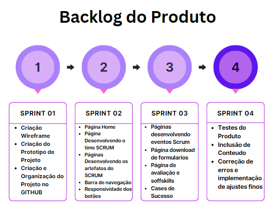

# Sprint 4 - 
 

  <a href ="#backlog"> Backlog da Sprint </a>  •
  <a href ="historias"> Histórias de Usuário •
  <a href ="#roadmap"> Roadmap </a> •
  <a href ="#tarefas"> Tarefas </a>

 
> Status da Sprint: Em planejamento

 
 

## 🔮 Backlog da Sprint 

|                            Tarefa                            |                          Descrição                           |               Histórias de Usuários                | Prioridade | Sprint | Estimativa de Esforço |       Status       |
| :----------------------------------------------------------: | :----------------------------------------------------------: | :------------------------------------------------: | :--------: | :----: | :-------------------: | :----------------: |
| Testes do Produto | Testar o funcioanento do site, para verificar algum erro de performace. | <a href='#us16'>US16</a> | Alta | 4 | 8h | 🚧 |
| Inclusão de Conteúdo | Inclusão de conteúdo na página de Artefatos Scrum | <a href='#us11'>US11</a> | Baixa | 4 | 8h | 🚧 |
| Correção de erros e implementação de ajustes finos | Correção de erros identificados e últimos ajustes solicitados pelo cliente | <a href='#us11'>US11</a> | Média | 4 | 4h | 🚧 |

 

## 📖 Histórias de Usuário

|          ID           |                     História de Usuário                      |
| :-------------------: | :----------------------------------------------------------: |
| US16 | Eu como colaborador, quero visualizar informações importantes sobre os objetivos da organização para entender e me alinhar as decisões, princípios e objetivos da mesma |
| US11 | Eu como desenvolvedor, quero corrigir erros identificados e implementar as melhorias necessárias para finalizar a criação do site |
| US11 | Eu como desenvolvedor, quero corrigir erros identificados e implementar as melhorias necessárias para finalizar a criação do site |
 

## 🗺️ Roadmap
<h1 align="center"> </h1> 

 

## 📝 Tarefas 
 
  
1. Os testes serão realizados para que possamos verificar alguma falha na performace do site.

2. Incluir conteúdo nas páginas de desenvolvimento dos eventos do SCRUM para demonstrar a importância dos mesmos e como sua aplicação é feita. Finalizando a implementação do conteúdo do projeto.

3. As correções de erros e implementação de ajustes finos buscam corrigir os ultimos ajustes solicitados pelo cliente.

 
 
