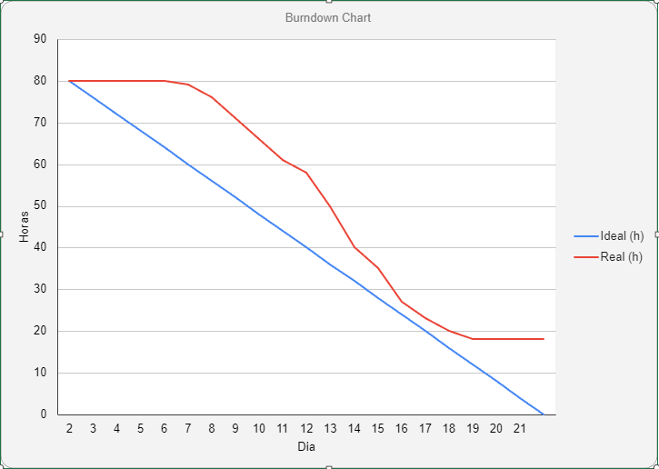
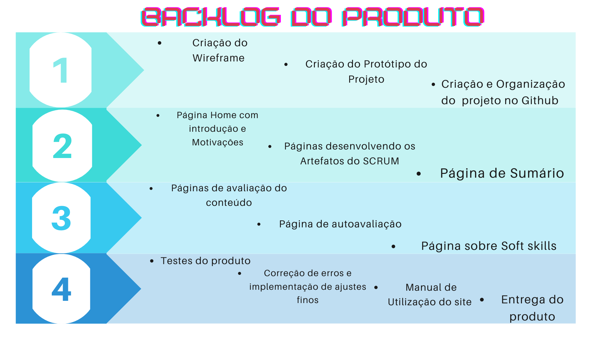

# API - ADS 1° Semestre - 2023

  <a href ="#desafio"> Desafio </a>  •
  <a href ="#projeto"> Projeto </a>  •
  <a href ="#metodologia"> Metodologia </a> •
  <a href ="#mvp"> MVP </a> •
  <a href ="#sprints"> Sprints </a>  • 
  <a href ="#backlog"> Backlog </a>  •
  <a href ="#burndown"> Burndown </a> •
  <a href ="#roadmap"> Roadmap </a> •
  <a href ="#equipe"> Equipe </a> •
  <a href ="#ponto"> Ponto Focal </a>

> Status do Projeto: Em andamento!

 
 
## 📝 Desafio 

Desenvolver um sistema web que indique todos os processos e artefatos da metodologia ágil (Scrum), todos os processos deverão ter conceitos e fundamentos com   referências, bem como a aplicação com exemplos práticos para a plena compreensão do usuário do sistema. Deverá criar um formulário para avaliações parciais e final (com totalização). O Sistema deve primordialmente ter foco na disseminação dos processos para que os usuários possam replicar todos os passos em futuros desenvolvimentos. A  prioridade secundária será a compreensão de habilidades (Skills) importantes para um profissional de tecnologia da informação.Todo o material de conhecimento publicado no sistema deverá ter forma indireta (Conhecimento adquirido e repassado pelos desenvolvedores). Bem como toda a documentação de desenvolvimento deverá ser lastreado no GitHub com todos os processos necessários para a fidelização do cliente. 

*Pré-requisitos:*

- [x] Linguagem de Programação Python (Requisito Fatec)
- [x] Linguagem de Marcação HTML e CSS (Requisito Fatec)
- [x] Protótipo no Figma (Requisito Fatec)
- [x] Framework SCRUM
- [x] Apresentação e Documentação via Github
- [x] O sistema web deverá ser intuitivo e não ter poluições de informações.  

## 💠 O Projeto

O grupo irá desenvolver um site de treinamento sobre o Scrum, em que nosso "cliente" utilizará tal site para treinar seus colaboradores para que possam aprender e aplicar a Metodologia Ágil em sua empresa.

## ☄️ Metodologia 

A metedologia utilizada no desenvolvimento do projeto é o próprio framework SCRUM, que tem como foco:

•  Realizar entregas frequentes e que gerem um retorno ao investimento dos clientes desde a primeira entrega. 
•  Reduzir os riscos do projeto, identificando e se adaptando aos impedimentos do projeto já desde o seu início. 
•  Uma maior qualidade do produto, passando por ajustes e refinamentos constantes dos requisitos. 
•  Adaptações e mudanças sendo transformadas em vantagem competitiva. 
•  Melhor visibilidade do andamento do projeto. 
•  Cortes de desperdício, através de um bom planejamento. 
•  Aumento da produtividade da Equipe de forma geral. 

## ✨ MVP 

Nosso "Mínimo produto viável" (MVP) é definido como algo que já pudesse retornar valor para nosso cliente desde o primeiro momento, sendo já no protótipo um meio para que os colaboradores de nosso cliente sejam introduzidos ao SCRUM e entendessem os motivos para introduzir e utilizar o framework no dia a dia para o trabalho.

## 🌵 Sprints 

- 1° SPRINT  - 13/03/2023 a 02/04/2023 | ([Link da Pasta](Doc/Sprints/Sprint-1)) Status: Em andamento
- 2º SPRINT  - 03/04/2023 a 23/04/2023 | ([Link da Pasta](Doc/Sprints/Sprint-2)) Status: Em planejanto
- 3º SPRINT  - 24/04/2023 a 14/05/2023 | ([Link da Pasta](Doc/Sprints/Sprint-3)) Status: Em planejanto
- 4º SPRINT  - 15/05/2023 a 04/06/2023 | ([Link da Pasta](Doc/Sprints/Sprint-4)) Status: Em planejanto

## 🔮 Backlog do Produto 

|                            Tarefa                            |                          Descrição                           |               Histórias de Usuários                | Prioridade | Sprint | Estimativa de Esforço |       Status       |
| :----------------------------------------------------------: | :----------------------------------------------------------: | :------------------------------------------------: | :--------: | :----: | :-------------------: | :----------------: |
| Wireframe do projeto | Visualizar de forma macro como será o esqueleto do site para criação do protótipo | <a href='#us01'>US01</a> | Média | 1 | 4h | :white_check_mark: |
| Criação de protótipo para o projeto |  Criar um protótipo simples e objetivo para que o cliente visualize o layout do site e a forma como as informações estão distribuidas, para então iniciar o processo de forma mais detalhada | <a href='#us02'>US02</a> | Alta | 1 | 8h | :white_check_mark: |
| Criação e organização do projeto no Github |  Criação de diretorios específicos para certos arquivos e organização dos mesmos  | <a href='#us03'>US03</a> | Alta | 1 | 4h | :white_check_mark: |
| Página Home com introdção e motivações para aprender SCRUM |  Criação da página inicial do site | <a href='#us04'>US04</a> | Alta | 2 | 8h | :contruction: |
| Páginas Desenvolvendo os artefatos do SCRUM |  Criação das páginas de conteúdo do site | <a href='#us05'>US05</a> | Alta | 2 | 16h | :contruction: |
| Página de Súmario |  Criação de uma página onde o colaborador possa visualizar os tópicos já lidos e as avaliações já feitas | <a href='#us06'>US06</a> | Alta | 2 | 8h | :contruction: |
| Páginas de avaliação do conteúdo | Criação de formulário de avaliação para avaliar o colaborador sobre o conteúdo do site | <a href='#us07'>US07</a> | Média | 3 | 4h | :contruction: |
| Página de autoavaliação | Criação de formulário de autoavaliação onde o colaborador fará uma autoavaliação dentro dos paramêtros estabelecidos pelo SCRUM | <a href='#us08'>US08</a> | Média | 3 | 4h | :contruction: |
| Página sobre Soft skills | Criação de página sobre a importância de Soft skills para o profissional de TI | <a href='#us09'>US09</a> | Baixa | 3 | 4h | :contruction: |
| Testes do Produto | Testes do produto para identificar possíveis erros e melhorias | <a href='#us10'>US10</a> | Média | 4 | 4h | contruction: |
| Correção de erros e implementação de ajustes finos |  Correção de erros identificados e últimos ajustes solicitados pelo cliente | <a href='#us11'>US11</a> | Média | 4 | 8h | :contruction: |
| Manual de utilização do site | Criação de manual para que o cliente entenda melhor o funcionamento do site | <a href='#us12'>US12</a> | Baixa | 4 | 2h | :contruction: |

 

## :book: Histórias de Usuário

|          ID           |                     História de Usuário                      |
| :-------------------: | :----------------------------------------------------------: |
| US01 | Eu como desenvolvedor, quero criar o esqueleto do site para começar a criação do protótipo |
| US02 | Eu como "cliente", quero visualizar a estrutura do projeto para validar o mesmo |
| US03 | Eu como Time de Desenvolvimento, quero ter acesso aos arquivos do projeto e a versões do projeto para efetuar futuras alterações |
| US04 | Eu como colaborador, quero entender o básico sobre SCRUM para entender os motivos do uso do framework na minha organização |
| US05 | Eu como colaborador, quero me apronfudar no método ágil para trabalhar de forma alinhada aos objetivos da minha organização |
| US06 | Eu como colaborador, quero ver todos os tópicos e avaliações do site caso queira acessar novamente um determinado conteúdo |
| US07 | Eu como "cliente", quero avaliar o quando meu colaborador está aprendendo sobre SCRUM para medir  seu conhecimento sobre o curso |
| US08 | Eu como "cliente", quero que meu colaborador se autoavalie para saber como ele vê seu próprio trabalho dentro da empresa |
| US09 | Eu como colaborador, quero aprender o que são Soft e aprender a desenvolvelas para melhorar meu desempenho como prestador de serviço |
| US10 | Eu como desenvolvedor, quero testar o produto para identificar possíveis erros e melhorias |
| US11 | Eu como desenvolvedor, quero corrigir erros identificados e implementar as melhorias necessárias para finalizar a criação do site |
| US12 | Eu como "cliente", quero entender o funcionamento do site para instruir meus colaboradores durante seu primeiro contato com o mesmo |

## 🔥 Burndown 

<h1 align="center"> </h1>

## 🗺️ Roadmap 

<h1 align="center"> </h1>

## 🏅 Grupo Hexabees 

|      Membro      |    Função     |                            Github                            |                           Linkedin                           |
| :--------------: | :-----------: | :----------------------------------------------------------: | :----------------------------------------------------------: |
| Sergio Henrique de Oliveira | (PO) | https://github.com/Sergio-Henrique49 | |
| Jaqueline Maria França Veloso da Silva | (SM) | https://github.com/jaquemfvs | | 
| Diego Rafael Moreno Vitvicki | (ST) | https://github.com/dievit | | 
| Pablo Rafael Rosa da Silva | (ST) | https://github.com/PabloEscobar9000 | | 
| Bianca Cepelo da Silva | (ST) | https://github.com/BiaCapelo | | 
| Luiz Eduardo Rosa da Silva | (ST) | https://github.com/eduardudu10 | | 
| Breno Augusto Santos Jesus | (ST) |  https://github.com/brenoasj | | 

## 👨‍🏫 Ponto Focal 

| M2              | P2       |
| :-------------------: | :-----------: |
| Jean Carlos Costa | Antônio Egydio |
